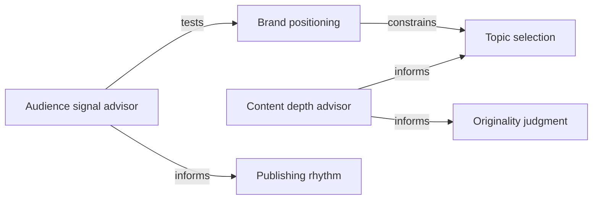

# Creator Publishing Lifecycle Reference Cluster

Scenario: decide whether content is worth creating, preserve positioning, and
publish at an appropriate quality and cadence.

This is an explicit technical/conformance reference. It does not claim that a
Cluster improves answers over the correct single KDNA.

## Members

The manifest selects exactly one primary and at most two optional advisors.
Every member is an independent, valid, authorizable `.kdna` asset.

| Member | Role |
|---|---|
| `@aikdna/creator-brand-positioning` | primary candidate |
| `@aikdna/creator-topic-selection` | primary candidate |
| `@aikdna/creator-originality-judgment` | primary candidate |
| `@aikdna/creator-publishing-rhythm` | primary candidate |
| `@aikdna/creator-content-depth` | optional advisor |
| `@aikdna/creator-audience-signal` | optional advisor |



The graph records contribution boundaries; it does not load every member.

## Explicit use

```bash
kdna cluster validate kdna.cluster.json
kdna cluster plan-use kdna.cluster.json \
  --task="Change our weekly publishing cadence after retention metrics fell" \
  --as=json
kdna cluster conflicts kdna.cluster.json \
  --task="Change our weekly publishing cadence after retention metrics fell" \
  --as=json
```

Install the independently distributed members before execution, then invoke
the Cluster explicitly:

```bash
kdna use kdna.cluster.json \
  --task="Change our weekly publishing cadence after retention metrics fell" \
  --runner=cli:default \
  --as=trace
```

The manifest is JSON, not a `.kdna` container. A single-asset `plan-load` or
`load` command never invokes this Cluster.

## Bounds and known limits

- exactly one primary;
- at most three loaded assets;
- no all-member fallback;
- missing primary blocks execution;
- optional-advisor failure is declared as continue-with-warning, but CLI
  0.30.4 currently fails the whole run;
- conflicts are surfaced rather than averaged;
- custom manifest token/character limits are declared but not yet propagated
  into the generated plan;
- routing is not promoted: current holdout evidence contains wrong-primary and
  out-of-domain failures.

Licensed under CC-BY-4.0; see `LICENSE`.

